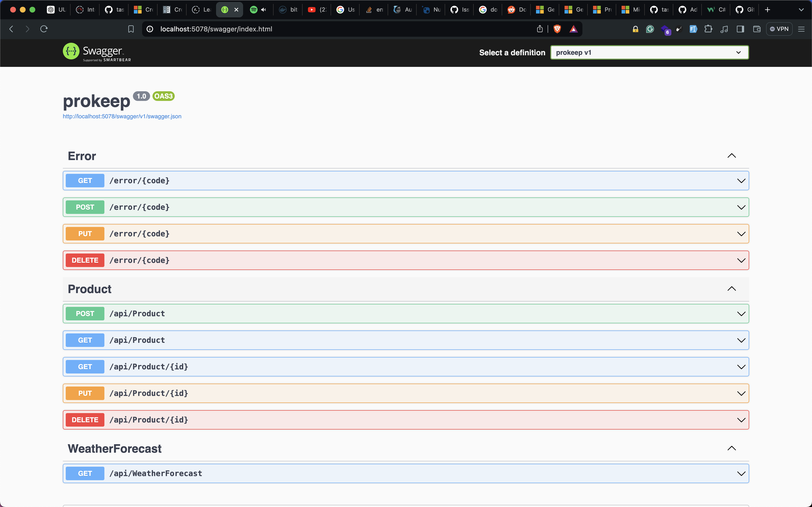
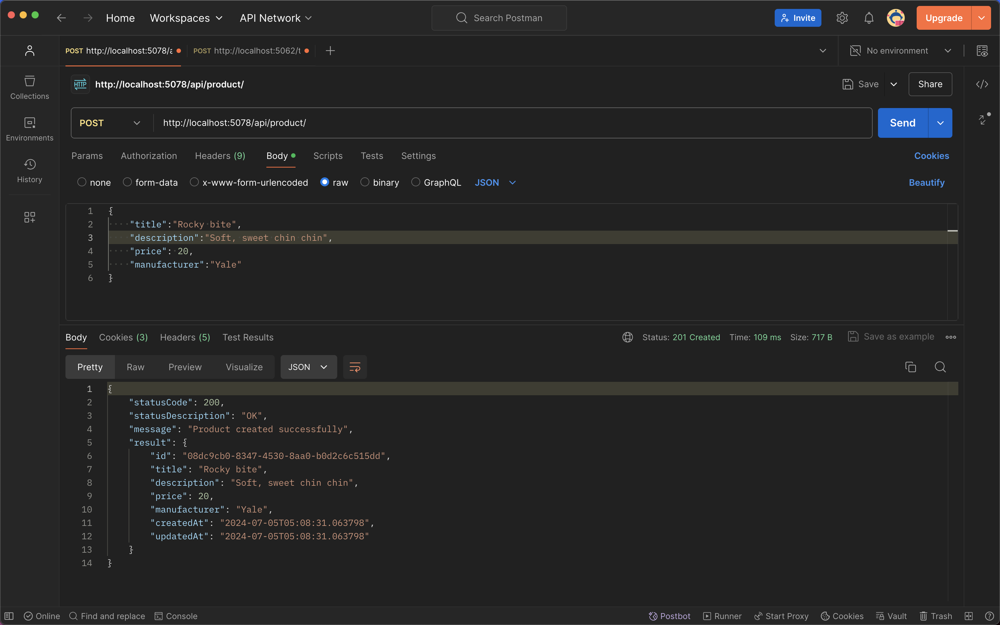
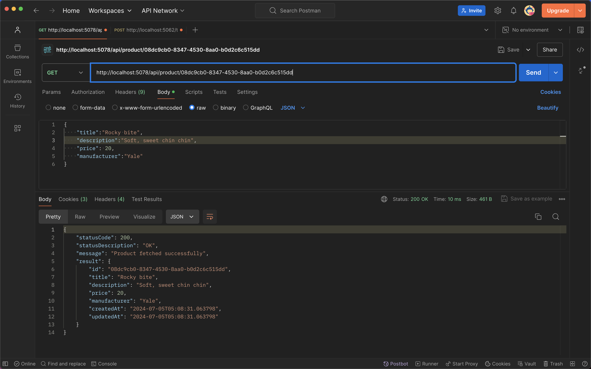
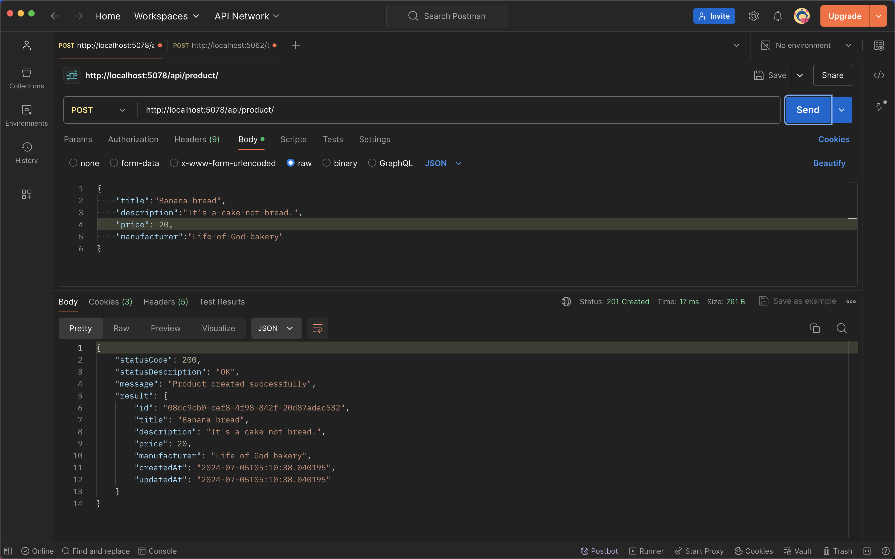
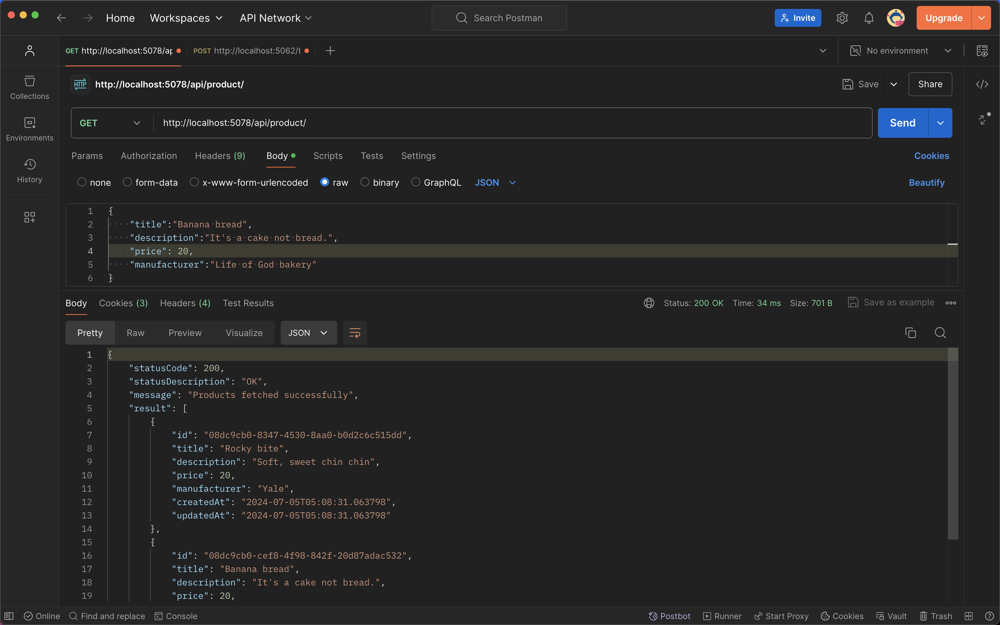
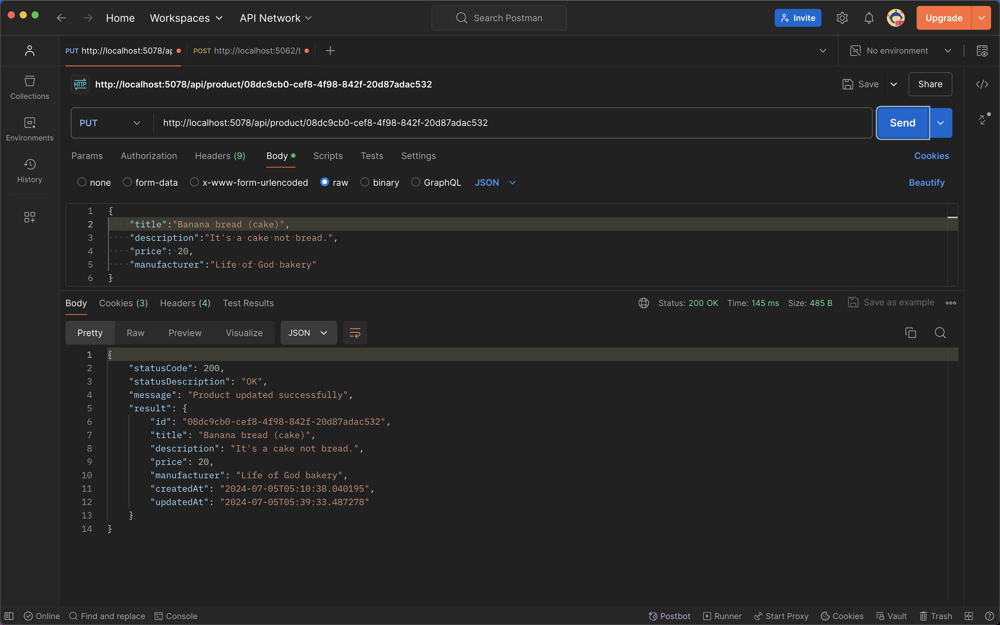
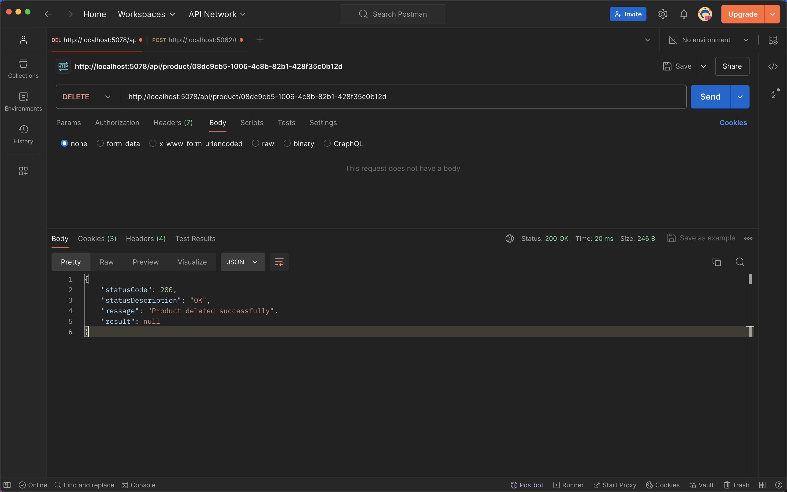

# Prokeep API 🎖️

This is a simple API built ASP.NET. I built this API to learn how building API's works in ASP.NET. This API is built with DOTNET 8, Entity Framework Core 8 and Postgres Database. Top that, this is my first API with **ASP.NET** and I love it.

## Table Of Content

- [Prokeep API 🎖️](#prokeep-api-️)
  - [Table Of Content](#table-of-content)
  - [Why I built this API 🤔](#why-i-built-this-api-)
  - [API Demo 🔧](#api-demo-)
  - [Resources 👜](#resources-)

## Why I built this API 🤔

I built this API to learn how building API's works in ASP.NET. This is part of my **C#Journey**. You can find that here.
<https://github.com/adedoyin-emmanuel/csharp-journey>. I've also learned a lot from building this project. I've learned how to document endpoints in **ASP.NET** `Swashbuckle`, adding Entity `CreatedAt` and `UpdatedAt` **Timestamp** using **EFCore**. I also learned a bit about **Automapper** and **MediaTR** even though I didn't use them in this project, I learned about the `record` type in **C#** and why it is recommended for **DTOS**, I also learned how to build **APIS** with consistent response payloads which I'm a fan of. You check out how I write my APIS in **NodeJS and Typescript** <https://github.com/adedoyin-emmanuel/nodejs-template>. I'm really happy because I've learned a lot, this time yesterday, I was battling bugs and all.. Concerning sending a consistent response to the client in **ASP.NET** check out this article <https://matteocontrini.medium.com/consistent-error-responses-in-asp-net-core-web-apis-bb70b435d1f8> which helped me to implement my own solution. You can also check how I implemented mine.

## API Demo 🔧

No be all these cho cho cho, show workings. Here are my workings my lord.

The Swagger documentation with `Swashbuckle`, made my life easier writing **API Documentation**

Testing the `Create-Product` endpoint with postman, BTW you should try that `Rocky-Bites`. It is an amazing chinchin. Why should you try it you may ask? Well, it is worth the price #100 (100 Naria), The quantity is great. It has a sweet soft milky texture that makes you crave for more when it lands in your mouth. Top that buying about 3 and drinking water should hold you for sometime.

Fetching all the products from the database

Creating a new product

Getting all products.

Updating a product

Deleting a product

## Resources 👜

As usual, I'm going to list out the resources I used to build this API. I'm using Youtube and <https://roadmap.sh>. I use <https://roadmap.sh> to check what I've to learn and then watch them on Youtube.

1. Become a ASP.NET Developer <https://roadmap.sh/aspnet-core>
2. ASP.NET Core Web API and Entity Framework Core - Full Course Including CRUD <https://www.youtube.com/watch?v=6YIRKBsRWVI>
3. Download (video with clipsave) ASP.NET Core Web API and Entity Framework Core - Full Course Including CRUD <https://clipsave.ng/app/youtube?url=https://www.youtube.com/watch?v=6YIRKBsRWVI>
4. Sameer Saini Udemy Full Course. You should check this out. It is massive. I'm also going to get it. <https://www.udemy.com/course/build-rest-apis-with-aspnet-core-web-api-entity-framework/?couponCode=JULY2024>

**Download Video**
<https://clipsave.ng/app/youtube?url=https://www.youtube.com/watch?v=6YIRKBsRWVI>

I will continue adding the resource I'm using to learn ASP.NET on my **C#Journey** repo and hopefully here too.
